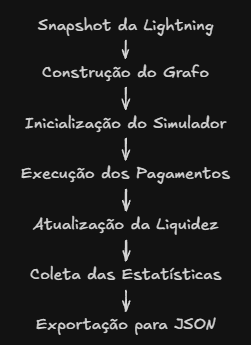

# Experimentos

Esta seção descreve os experimentos realizados para avaliar o comportamento do simulador de roteamento desenvolvido neste projeto. O objetivo dos testes foi observar como diferentes níveis de utilização da rede influenciam a disponibilidade de liquidez, a taxa de sucesso dos pagamentos e a arrecadação de taxas pelos nós intermediários.

Todos os experimentos foram executados utilizando a mesma implementação apresentada nas seções anteriores, variando apenas a quantidade e o valor das transações simuladas.

---

## Objetivos dos Experimentos

Os experimentos possuem quatro objetivos principais:

- Avaliar a capacidade do algoritmo de encontrar rotas viáveis;
- Analisar o impacto do consumo progressivo da liquidez;
- Observar a evolução das taxas arrecadadas pelos nós roteadores;
- Otimizar o comportamento da rede sob diferentes níveis de carga.

Para isso, foram definidos três cenários independentes de simulação.

---

## Configuração Experimental

Todos os experimentos seguiram o mesmo fluxo de execução.

Inicialmente, o snapshot da Lightning Network foi convertido para o formato JSON e utilizado para construir o grafo direcionado da rede.

Em seguida, foi criada uma nova instância do simulador contendo uma cópia completa do grafo.

Cada cenário inicia com a rede em seu estado original, evitando que o consumo de liquidez de um experimento interfira nos demais.

O fluxo de execução pode ser resumido da seguinte forma:



---

## Cenários Avaliados

Os cenários foram definidos diretamente no módulo `run_experiments.py`.

Cada cenário representa uma condição distinta de utilização da rede.

#### Cenário 1 — Tráfego Leve

Neste cenário foram simulados **50 pagamentos**, utilizando valores relativamente baixos.

Características:

- Quantidade reduzida de transações;
- Baixo consumo de liquidez;
- Pequena utilização dos canais.

O objetivo desse cenário é representar uma rede pouco congestionada.

---

#### Cenário 2 — Tráfego Médio

Neste cenário foram simulados **200 pagamentos** com valores intermediários.

Características:

- Maior utilização da rede;
- Aumento do consumo de liquidez;
- Maior competição entre as rotas disponíveis.

Esse cenário representa uma situação de utilização moderada da Lightning Network.

---

#### Cenário 3 — Stress Alto

O último cenário simula uma condição extrema da rede.

Foram executados **500 pagamentos**, utilizando valores significativamente maiores.

Características:

- Elevado consumo da liquidez;
- Maior quantidade de falhas de roteamento;
- Concentração do tráfego em poucos canais;
- Aumento das taxas arrecadadas pelos nós intermediários.

Esse cenário permite avaliar o comportamento do algoritmo quando a disponibilidade de liquidez se torna limitada.

---

## Geração dos Pagamentos

Durante cada experimento, os pagamentos são gerados automaticamente.

Para cada transação são escolhidos:

- Um nó de origem;
- Um nó de destino;
- Um valor aleatório dentro dos limites definidos para o cenário.

A seleção aleatória permite produzir diferentes padrões de utilização da rede ao longo da simulação.

Após cada pagamento bem-sucedido, a capacidade disponível dos canais utilizados é reduzida, simulando o consumo de liquidez observado na Lightning Network.

---

## Métricas Coletadas

Ao término de cada experimento, o simulador registra automaticamente diversas informações estatísticas.

As métricas atualmente coletadas são:

| Métrica | Descrição |
|----------|-----------|
| Total de pagamentos | Quantidade de transações simuladas |
| Pagamentos bem-sucedidos | Número de pagamentos concluídos |
| Falhas | Quantidade de pagamentos sem rota viável |
| Taxa de sucesso | Percentual de pagamentos concluídos |
| Taxas arrecadadas | Soma das taxas recebidas pelos nós intermediários |
| Nós mais lucrativos | Nós que obtiveram maior arrecadação durante a simulação |

Esses resultados são armazenados automaticamente em um arquivo JSON para posterior análise.

---

## Armazenamento dos Resultados

Após o término de cada cenário, os resultados são exportados para o arquivo

```text
data/resultados_experimentos.json
```

Esse arquivo centraliza todas as métricas produzidas durante os experimentos, permitindo que os resultados sejam posteriormente utilizados para construção de tabelas, gráficos e análises estatísticas.

---

## Reprodutibilidade

Uma das preocupações durante o desenvolvimento foi garantir que os experimentos pudessem ser facilmente reproduzidos.

Para isso:

- todos os cenários são definidos diretamente no código-fonte;
- cada experimento inicia com uma nova cópia do grafo original;
- os resultados são exportados automaticamente em formato JSON;
- a metodologia de execução permanece idêntica para todos os cenários.

Essa abordagem facilita tanto a repetição dos experimentos quanto a comparação entre diferentes versões do simulador.

---

## Considerações

Os experimentos foram planejados para avaliar o comportamento do algoritmo em diferentes níveis de utilização da Lightning Network, permitindo observar como a disponibilidade de liquidez influencia o sucesso do roteamento de pagamentos.

Os resultados obtidos nesses cenários serão apresentados e analisados na próxima seção.