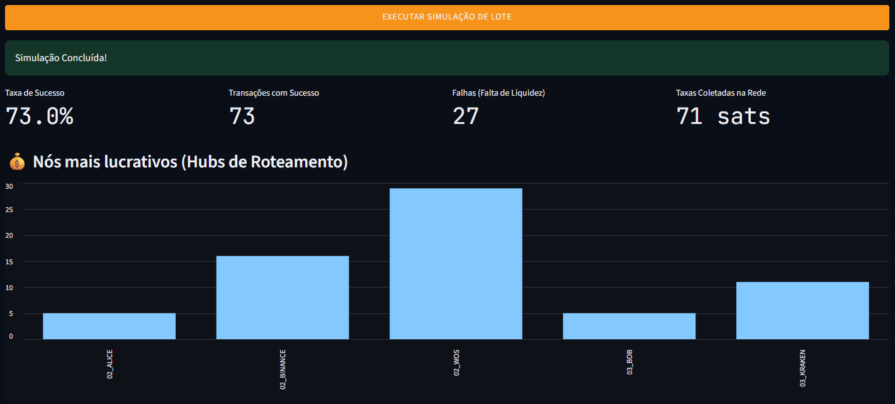

# Implementação

Esta seção apresenta a arquitetura da aplicação desenvolvida para simular o roteamento de pagamentos na Lightning Network. O projeto foi implementado em Python e organizado de forma modular, separando as responsabilidades de aquisição dos dados, construção do grafo, cálculo das rotas, simulação da rede e interface com o usuário.

Essa divisão facilita tanto a manutenção quanto a evolução do sistema, permitindo que novos algoritmos ou estratégias de roteamento possam ser incorporados sem alterações significativas nos demais componentes.

---

## Arquitetura Geral

A Figura abaixo apresenta a organização dos principais módulos do projeto.

```text
                    gossip.bz2
                         │
                         ▼
                   gera_JSON.py
                         │
                         ▼
                  ln_sample.json
                         │
                         ▼
          script_de_construcao_do_grafo.py
                         │
                         ▼
                 Grafo (NetworkX)
                         │
         ┌───────────────┴───────────────┐
         ▼                               ▼
 2_route_finder.py             run_experiments.py
         │                               │
         └───────────────┬───────────────┘
                         ▼
                      app.py
                         │
                         ▼
                Interface Streamlit
```

Cada módulo possui responsabilidades bem definidas, descritas nas seções seguintes.

---

## Conversão do Snapshot

A primeira etapa consiste na conversão do snapshot público da Lightning Network.

O módulo `gera_JSON.py` recebe como entrada o arquivo compactado contendo as informações públicas da rede:

```python
build_json_from_gossip(
    "data/gossip.bz2",
    "data/ln_sample.json"
)
```

Ao término da execução é produzido um arquivo JSON contendo apenas as informações necessárias para o simulador.

Essa etapa reduz significativamente a complexidade de leitura dos dados durante a execução da aplicação.

---

## Construção do Grafo

O módulo `script_de_construcao_do_grafo.py` é responsável por transformar o arquivo JSON em um grafo direcionado utilizando a biblioteca NetworkX.

Inicialmente são inseridos todos os participantes da Lightning Network como vértices do grafo.

Posteriormente cada canal é convertido em duas arestas direcionadas.

Essa representação é necessária porque cada direção do canal pode possuir políticas distintas de roteamento.

Para cada aresta são armazenados atributos como:

- Identificador do canal;
- Capacidade;
- Taxa fixa;
- Taxa proporcional.

Além disso, canais que não possuem políticas válidas em ambos os sentidos são descartados antes da construção do grafo.

---

## Algoritmo de Roteamento

O cálculo das rotas é realizado pelo módulo `2_route_finder.py`.

A implementação utiliza o algoritmo de Dijkstra disponibilizado pela biblioteca NetworkX.

Entretanto, a função de custo utilizada durante a busca foi personalizada para refletir características da Lightning Network.

Antes que uma aresta seja considerada durante a busca são realizadas duas verificações:

- Se o canal possui capacidade suficiente para transportar o pagamento;
- Q ual será o custo financeiro daquele salto.

O custo utilizado pelo algoritmo é calculado a partir da soma entre a taxa fixa do canal e sua taxa proporcional ao valor transportado.

Dessa forma, o algoritmo procura a rota de menor custo respeitando simultaneamente as restrições de capacidade da rede.

---

## Simulação da Liquidez

Uma das principais funcionalidades implementadas no projeto é a simulação dinâmica da liquidez dos canais.

Essa funcionalidade foi desenvolvida através da classe `LightningSimulator`.

Após cada pagamento realizado com sucesso são executadas três operações:

1. Redução da capacidade disponível dos canais utilizados;
2. Contabilização das taxas cobradas pelos nós intermediários;
3. Atualização das estatísticas da simulação.

Essa estratégia permite reproduzir o esgotamento gradual da liquidez da rede durante sucessivos pagamentos.

Embora simplifique o funcionamento real da Lightning Network, esse modelo possibilita analisar o impacto da utilização contínua dos canais sobre o desempenho do roteamento.

---

## Execução dos Experimentos

Os experimentos são realizados pelo módulo `run_experiments.py`.

Cada cenário inicia com uma nova cópia do grafo original, garantindo que todos os testes sejam executados a partir das mesmas condições iniciais.

Durante cada experimento são gerados pagamentos aleatórios entre diferentes pares de nós.

Ao final da execução são registradas métricas como:

- Número total de pagamentos;
- Taxa de sucesso;
- Falhas por falta de liquidez;
- Taxas arrecadadas;
- Nós mais lucrativos.

Os resultados são armazenados automaticamente em formato JSON para posterior análise.

---

## Interface da Aplicação

A interação com o usuário é realizada através de uma interface desenvolvida em Streamlit.

A aplicação permite selecionar:

- Nó de origem;
- Nó de destino;
- Valor da transação.

Após a execução do algoritmo são apresentados:

- Rota encontrada;
- Custo total;
- Capacidade dos canais;
- Gargalos da rota;
- Visualização gráfica utilizando PyVis.

Além do cálculo individual de rotas, a interface também permite executar simulações em lote para análise do comportamento da rede sob diferentes níveis de utilização.

> **Figura X** — Interface principal da aplicação.
>
> **

---

## Organização do Código

A estrutura do projeto foi organizada conforme apresentado abaixo.

```text
projeto-final-grupo1/

├── app.py
│
├── src/
│   ├── gera_JSON.py
│   ├── script_de_construcao_do_grafo.py
│   ├── 2_route_finder.py
│   └── run_experiments.py
│
├── data/
│   ├── gossip.bz2
│   ├── ln_sample.json
│   └── resultados_experimentos.json
│
└── docs/
```

Essa organização permite separar claramente as etapas de preparação dos dados, implementação do algoritmo, execução dos experimentos e documentação do projeto.

---

## Fluxo de Execução

O funcionamento completo da aplicação pode ser resumido pelo fluxo apresentado abaixo.

```text
Snapshot da Lightning
          │
          ▼
Conversão para JSON
          │
          ▼
Construção do Grafo
          │
          ▼
Seleção da Origem e Destino
          │
          ▼
Cálculo da Melhor Rota
          │
          ▼
Atualização da Liquidez
          │
          ▼
Visualização dos Resultados
          │
          ▼
Execução de Experimentos
          │
          ▼
Análise Estatística
```

---

## Considerações

A arquitetura modular adotada durante o desenvolvimento permitiu separar claramente as responsabilidades dos diferentes componentes da aplicação.

Essa abordagem tornou possível desenvolver, testar e evoluir individualmente cada etapa do simulador, desde a preparação do conjunto de dados até a execução dos experimentos e visualização dos resultados.

Nos capítulos seguintes serão apresentados os experimentos realizados sobre a rede e a análise dos resultados obtidos.