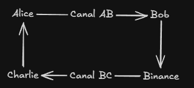
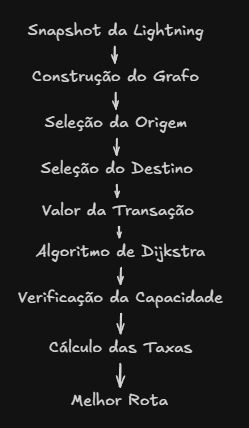

# Lightning Network

## O problema da escalabilidade do Bitcoin

O Bitcoin foi projetado para priorizar segurança, descentralização e resistência à censura. Como consequência dessa arquitetura, sua capacidade de processamento é relativamente limitada quando comparada a sistemas tradicionais de pagamento.

Cada bloco da blockchain possui capacidade limitada e é produzido, em média, a cada dez minutos. Dessa forma, apenas um número reduzido de transações pode ser confirmado diretamente na camada principal (*Layer 1*), tornando inviável a utilização da rede para pagamentos instantâneos em larga escala.

Além da limitação de desempenho, períodos de maior utilização da rede costumam elevar as taxas de transação, dificultando a realização de micropagamentos.

A Lightning Network foi proposta justamente para solucionar esse problema sem modificar o protocolo principal do Bitcoin.

---

## O que é a Lightning Network

A Lightning Network é uma solução de segunda camada (*Layer 2*) construída sobre o Bitcoin.

Em vez de registrar cada pagamento diretamente na blockchain, dois participantes estabelecem previamente um canal de pagamento. Durante a existência desse canal, podem ocorrer inúmeras transações instantâneas entre as partes, sendo apenas a abertura e o fechamento registrados na blockchain.

Quando não existe um canal direto entre remetente e destinatário, a Lightning Network permite que o pagamento seja encaminhado através de nós intermediários, formando uma rota temporária entre origem e destino.

Essa característica transforma naturalmente a rede em um grande grafo distribuído.

---

## Canais de Pagamento

Um canal de pagamento representa uma conexão entre dois participantes da Lightning Network.

Cada canal possui uma quantidade máxima de bitcoins que pode transportar, denominada **capacidade** (*capacity*).

Além da capacidade, cada direção do canal possui sua própria política de roteamento, incluindo:

- taxa fixa (*base fee*);
- taxa proporcional ao valor da transação (*fee rate*).

Como as políticas podem ser diferentes em cada sentido do canal, a Lightning Network é normalmente representada como um **grafo direcionado**, mesmo que fisicamente o canal seja bidirecional.

No projeto desenvolvido, cada canal do arquivo JSON é convertido em duas arestas direcionadas, uma para cada sentido da comunicação.

---

## Liquidez

Embora um canal possua determinada capacidade, nem toda essa capacidade está necessariamente disponível para um único participante.

Na Lightning Network, a liquidez corresponde ao saldo efetivamente disponível em uma direção específica do canal.

Essa característica torna o problema de roteamento significativamente mais complexo do que um simples cálculo de menor caminho.

Um caminho pode existir topologicamente, mas ainda assim não permitir a realização do pagamento caso algum dos canais não possua liquidez suficiente.

No simulador desenvolvido neste projeto, a liquidez é representada de forma simplificada através da capacidade disponível em cada canal. Após cada pagamento realizado com sucesso, a capacidade utilizada é reduzida, simulando o consumo progressivo da liquidez da rede.

---

## Taxas de Roteamento

Os nós intermediários são incentivados economicamente a encaminhar pagamentos através da cobrança de pequenas taxas.

Cada taxa é composta por duas parcelas:

- uma taxa fixa (*base fee*);
- uma taxa proporcional ao valor transportado.

Neste projeto, o custo de cada canal é calculado utilizando a expressão

\\[
Fee = BaseFee + Valor \times FeeRate
\\]

onde o valor da transação é convertido para millisatoshis (msat), que seria como uma fração de milhão, sendo a unidade utilizada internamente pela Lightning Network.

Essas taxas são utilizadas como peso durante a execução do algoritmo de roteamento.

---

## Roteamento de Pagamentos

Quando um usuário deseja enviar um pagamento para outro participante da rede, é necessário encontrar uma sequência de canais capaz de transportar aquele valor até o destino.

Esse processo deve considerar simultaneamente:

- conectividade entre os nós;
- capacidade disponível dos canais;
- custo das taxas cobradas pelos nós intermediários.

Neste projeto, o problema é resolvido utilizando o algoritmo de Dijkstra com uma função de custo personalizada.

Durante a busca, canais cuja capacidade seja inferior ao valor da transação são automaticamente descartados, enquanto os canais restantes recebem como peso o custo de roteamento calculado a partir de suas políticas de taxa.

Essa abordagem permite encontrar uma rota de menor custo respeitando as restrições de capacidade existentes na rede.

---

## Modelagem em Grafos

Toda a Lightning Network pode ser representada como um grafo direcionado ponderado.

Neste trabalho:

- cada participante da rede corresponde a um vértice;
- cada canal corresponde a uma aresta direcionada;
- cada aresta possui atributos como capacidade, taxa fixa e taxa proporcional.

Essa modelagem permite aplicar algoritmos clássicos de teoria dos grafos para resolver o problema de roteamento.

A Figura abaixo resume a representação utilizada pelo simulador.

**

Embora simplificada, essa representação preserva as principais características necessárias para o cálculo das rotas.

---

## Relação com este projeto

O simulador desenvolvido utiliza um *snapshot* público da Lightning Network para construir automaticamente esse grafo.

Após o carregamento dos dados, cada pagamento solicitado pelo usuário segue o fluxo abaixo:

Nos capítulos seguintes serão apresentados os detalhes da construção do conjunto de dados, da implementação do simulador e dos experimentos realizados.