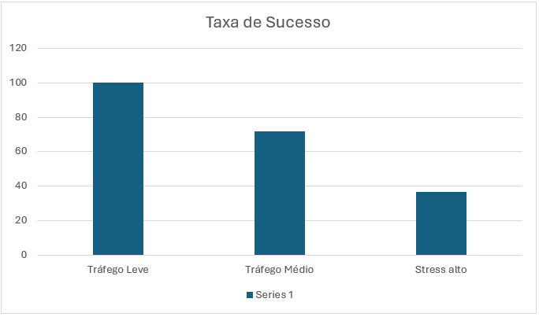
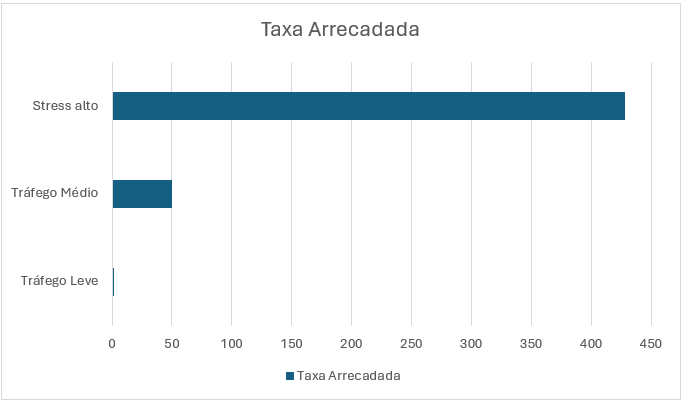

# Resultados

Esta seção apresenta os resultados obtidos durante a execução dos experimentos descritos anteriormente. Os dados foram coletados automaticamente pelo simulador e armazenados no arquivo `resultados_experimentos.json`, permitindo comparar o comportamento da rede sob diferentes níveis de utilização.

Os resultados apresentados correspondem aos três cenários definidos durante os experimentos:

- Tráfego Leve;
- Tráfego Médio;
- Stress Alto.

---

## Visão Geral

A Tabela 1 apresenta um resumo das principais métricas coletadas durante cada cenário.

| Cenário | Pagamentos | Sucessos | Falhas | Taxa de Sucesso | Taxas Arrecadadas (sats) |
|----------|-----------:|---------:|--------:|----------------:|-------------------------:|
| Tráfego Leve | 50 | 50 | 0 | **100,0%** | 2 |
| Tráfego Médio | 200 | 144 | 56 | **72,0%** | 50 |
| Stress Alto | 500 | 184 | 316 | **36,8%** | 428 |

Observa-se uma redução significativa da taxa de sucesso conforme aumenta o número de pagamentos executados. Em contrapartida, a quantidade total de taxas arrecadadas cresce consideravelmente, indicando maior utilização dos canais remanescentes da rede.

---

## Taxa de Sucesso

A Figura 1 apresenta a taxa de sucesso obtida em cada cenário.

> **Figura 1** – Comparação da taxa de sucesso dos pagamentos.
>
> **

Os resultados demonstram que:

- O cenário de tráfego leve apresentou sucesso em todos os pagamentos;
- O cenário intermediário apresentou redução da disponibilidade de rotas;
- O cenário de stress apresentou uma queda acentuada da taxa de sucesso.

Esse comportamento é consistente com a simulação de esgotamento progressivo da liquidez implementada pelo simulador.

---

## Falhas de Roteamento

A quantidade de falhas aumentou significativamente conforme o volume de pagamentos cresceu.

| Cenário | Falhas |
|----------|--------:|
| Tráfego Leve | 0 |
| Tráfego Médio | 56 |
| Stress Alto | 316 |

Como os canais utilizados têm sua capacidade reduzida após cada pagamento bem-sucedido, parte das rotas inicialmente disponíveis torna-se inviável ao longo da simulação.

Consequentemente, o algoritmo passa a encontrar um número menor de caminhos capazes de transportar os valores solicitados.

---

## Taxas Arrecadadas

A Figura 2 apresenta o total de taxas arrecadadas pelos nós intermediários.

> **Figura 2** – Comparação da taxa arrecadada.
>
> **

O aumento observado ocorre porque:

- Um número maior de pagamentos é processado;
- As rotas passam a utilizar caminhos alternativos;
- Mais nós intermediários participam do roteamento.

Mesmo com a redução da taxa de sucesso, os pagamentos concluídos tendem a percorrer caminhos que geram maior arrecadação para os roteadores.

---

## Nós com Maior Arrecadação

Durante cada cenário foram registrados os nós que obtiveram maior lucro com o encaminhamento de pagamentos.

### Tráfego Leve

| Nó | Lucro (sats) |
|-----|-------------:|
| Binance Node | 2 |
| Charlie's Node | 0 |
| David's Node | 0 |
| Alice Routing | 0 |
| ACINQ Node | 0 |

---

### Tráfego Médio

| Nó | Lucro (sats) |
|-----|-------------:|
| Kraken Node | 15 |
| Binance Node | 14 |
| Wallet Of Satoshi | 9 |
| Bob's Node | 6 |
| Alice Routing | 3 |

---

### Stress Alto

| Nó | Lucro (sats) |
|-----|-------------:|
| Wallet Of Satoshi | 248 |
| Kraken Node | 118 |
| Binance Node | 48 |
| Bob's Node | 8 |
| Alice Routing | 4 |

Os resultados mostram que poucos nós concentram grande parte das taxas arrecadadas, especialmente durante cenários de maior utilização da rede.

---

## Evolução Entre os Cenários

Comparando os três cenários, observa-se um comportamento consistente.

À medida que aumenta o número de pagamentos:

- Cresce o consumo da liquidez disponível;
- Diminui a quantidade de rotas viáveis;
- Reduz-se a taxa de sucesso;
- Aumenta a arrecadação dos nós que permanecem disponíveis para roteamento.

Esses resultados demonstram que a disponibilidade de liquidez possui influência direta sobre a eficiência do algoritmo de roteamento.

---

## Síntese dos Resultados

Os experimentos evidenciam três tendências principais:

1. A redução progressiva da liquidez impacta diretamente a capacidade da rede de concluir novos pagamentos.

2. O aumento do tráfego provoca crescimento significativo da arrecadação de taxas pelos nós intermediários.

3. Poucos nós concentram grande parte da receita obtida com o roteamento, especialmente nos cenários de maior carga.

Essas observações serão discutidas com maior profundidade na próxima seção.